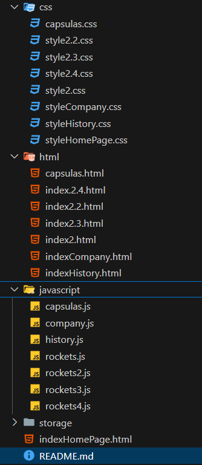

# SpaceX Project

Este proyecto se centra en la creación de una interfaz web para explorar la historia y los cohetes de SpaceX, utilizando HTML, CSS y JavaScript, y haciendo uso de la API de SpaceX.

### Descripción Comercial de SpaceX

**SpaceX** (Space Exploration Technologies Corp.) es una empresa líder en la exploración espacial, fundada por Elon Musk en 2002. Su misión es reducir costos de viajes espaciales y facilitar la colonización de Marte. 

#### Módulos del Proyecto

1. **Historia**: Destaca los hitos más significativos de SpaceX, como el primer lanzamiento privado exitoso y la primera misión comercial a la EEI.

2. **Cohetes**: Presenta los cohetes reutilizables **Falcon 1**, **Falcon 9**, **Falcon Heavy** y **Starship**, que establecen nuevos estándares en la industria espacial.

3. **Cápsulas**: Describe las cápsulas como la **Crew Dragon**, diseñadas para transportar astronautas y carga de manera segura.

4. **Compañía**: Ofrece una visión de la filosofía y objetivos de SpaceX, centrados en democratizar el acceso al espacio y llevar a la humanidad a Marte.

### Conclusión

El proyecto de SpaceX combina historia, tecnología y ambición, invitando a los usuarios a explorar su legado y futuro en la exploración espacial.

## Contenido del Proyecto

### Estructura de Archivos

- **HTML**
  - `indexHomePage.html`: Página de inicio del proyecto.
  - `indexCompany.html`: Información sobre la compañía SpaceX.
  - `capsulas.html`: Detalles sobre las cápsulas utilizadas por SpaceX.
  - `indexHistory.html`: Historial de eventos de SpaceX.
  - `index2.html`: Detalles sobre el cohete Falcon 1.
  - `index2.2.html`: Detalles sobre el cohete Falcon 9.
  - `index2.3.html`: Detalles sobre el cohete Falcon Heavy.
  - `index2.4.html`: Detalles sobre el cohete Starship.

- **CSS**
  - `styleHistory.css`: Estilos para la página de historia.
  - `style2.css`: Estilos para la página de Falcon 1.
  - `style2.2.css`: Estilos para la página de Falcon 9.
  - `style2.3.css`: Estilos para la página de Falcon Heavy.
  - `style2.4.css`: Estilos para la página de Starship.
  - `capsulas.css`: Estilos para la página de cápsulas.
  - `styleCompany.css`: Estilos para la página de la compañía.
  - `styleHomePage.css`: Estilos para la página de inicio.

- **JavaScript**
  - `history.js`: Lógica para recuperar y mostrar eventos históricos de SpaceX.
  - `rockets.js`: Lógica para recuperar información sobre los cohetes.
  - `rockets2.js`: Lógica adicional para los detalles de Falcon 9.
  - `rockets3.js`: Lógica adicional para los detalles de Falcon Heavy.
  - `rockets4.js`: Lógica adicional para los detalles de Starship.
  - `company.js`: Lógica para recuperar y mostrar información sobre la compañía.
  - `capsulas.js`: Lógica para recuperar y mostrar información sobre las cápsulas utilizadas por SpaceX.

### Descripción de las Secciones

#### 1. History

- **HTML**: Estructura básica que incluye un encabezado, una sección principal para mostrar eventos históricos, y un menú de navegación.
- **JavaScript**: Utiliza la API de SpaceX para obtener eventos históricos y mostrarlos en la página. Cada evento incluye un título, detalles y una fecha formateada.

#### 2. Rockets

- **HTML**: Contiene secciones para mostrar el estado del sistema, información del cohete, datos de velocidad y rango, y un carrusel de imágenes.
- **JavaScript**: Recupera información sobre los cohetes desde la API de SpaceX. Muestra detalles como nombre, altura, diámetro, masa, empuje, y más. También incluye un carrusel de imágenes de cada cohete.

#### 3. Cápsulas

- **HTML**: Estructura que presenta información sobre las diferentes cápsulas utilizadas por SpaceX, incluyendo sus especificaciones técnicas y su historia.
- **JavaScript**: Recupera datos de la API de SpaceX para mostrar detalles sobre cada cápsula, como el nombre, tipo, misión, y características técnicas. También puede incluir imágenes y descripciones de cada cápsula.

#### 4. Compañía

- **HTML**: Contiene información sobre SpaceX, incluyendo su historia, misión y logros.
- **JavaScript**: Utiliza la API de SpaceX para obtener y mostrar datos sobre la compañía, como su fundador, metas, hitos importantes, y datos de contacto. Esta sección está diseñada para dar a los usuarios una visión completa de lo que SpaceX representa y sus contribuciones a la industria aeroespacial.

### Cohetes Incluidos

1. **Falcon 1**
2. **Falcon 9**
3. **Falcon Heavy**
4. **Starship**

### API Utilizada

El proyecto utiliza la API de SpaceX para obtener datos en tiempo real sobre la historia de la compañía y sus cohetes. Las URLs de las API son:

- Historial: `https://api.spacexdata.com/v4/history`
- Cohetes: `https://api.spacexdata.com/v4/rockets`
- Compañía: `https://api.spacexdata.com/v4/company`
- Cápsulas: `https://api.spacexdata.com/v4/capsules`

### Tecnologías utilizadas

- HTML5
- CSS3
- JS

### Pantallas Disponibles

- **Computador 1920 x 1080 Pixeles*
- **Iphone 14 Pro Max 430 x 932 Pixeles*

### Consideraciones

- Asegúrate de tener acceso a Internet para cargar los datos de la API.
- El diseño es responsivo y está optimizado para pantallas 
- Se recomienda utilizar un navegador moderno para garantizar la compatibilidad.

### Instrucciones de uso

1. Clona este repositorio o descarga los archivos en tu máquina local.
2. Abre el archivo `indexHomePage.html` en un navegador web compatible.

## Desarrolladores

Este proyecto ha sido desarrollado por:
- Jaime Enrique Barrera Sandoval
- Jhontanan Eduardo Omaña Garcia

Como parte del Proyecto en JAVASCRIPT.
